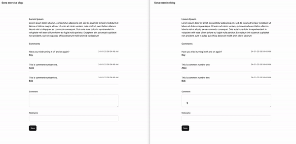

# RealTimeComments

A simple exercise showcasing how Elixir and Phoenix can be used to implement blog post commenting functionality. New comments appear in real time.

## Running

Requirements:
* Erlang 26.0
* Elixir 1.16.0
* Docker

1. Clone the repo.
2. Run `make local-server`, this will start and setup a local database in Docker and then start the Phoenix application.
3. Run `make local-seeds` to create some example posts.
4. Navigate to `localhost:4000` and open a post.
5. Repeat step 4 in another browser window.
6. You should see that adding a post in one window makes it immediately visible in the other.

## Key ideas
* Real-time updates are achieved using LiveView.
* PubSub is used to update other LivewView processes viewing the same post.
* Basing styling is done with TailwindCSS.
* Most resources were generated using Phoenix generators and then cleaned up.
* Basic testing is done using LiveViewTest.

## Further improvements
There are multiple ways in which this project could be improved:
* Pagination or infinite scrolling of comments when the list of comments becomes large.
* Clustering so that the real-time aspect works when multiple instances of the application are deployed.
* Better handling of error cases, e.g. rejected form submissions.
* More test coverage.
